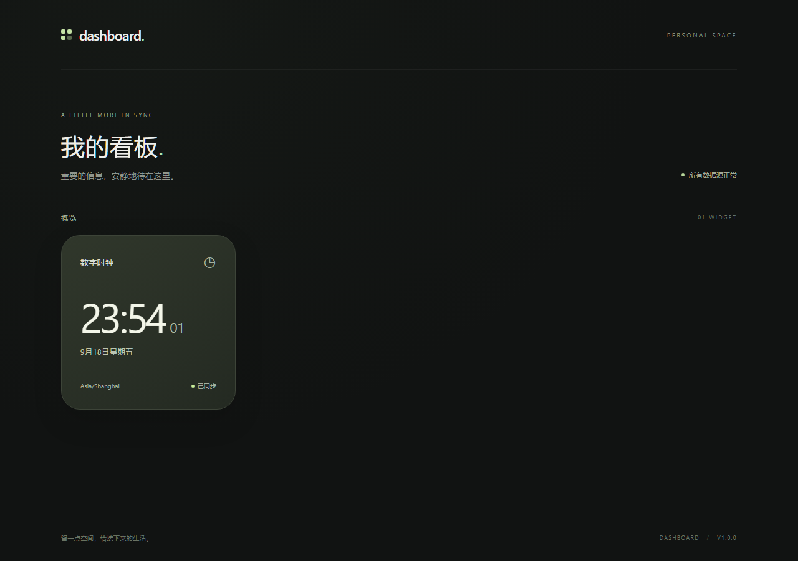

# Dashboard

面向网页、安卓和嵌入式屏幕的模块化个人看板。服务器统一接入数据，组件独立设计，设备通过版本化协议读取数据与配置。

首版目标：一个 Docker 应用提供网页与 API，通过 NTP 获取时间，在网页显示一个固定 **1×1 数字时钟**。项目文档是后续开发的规范入口。



[持续集成与镜像发布状态](https://github.com/ccawmiku/dashboard/actions/workflows/ci.yml)

## 阅读顺序

1. [产品范围与验收](docs/01-product.md)：做什么、当前不做什么。
2. [系统架构](docs/02-architecture.md)：模块职责、依赖、部署边界。
3. [数据与 API 契约](docs/03-contracts.md)：数据点、组件、看板、错误和版本。
4. [连接器开发规范](docs/04-connectors.md)：数据接入、调度和故障处理。
5. [组件开发规范](docs/05-widgets.md)：固定尺寸组件、主题、预览和隔离。
6. [NTP 时钟设计](docs/06-ntp-clock.md)：时间来源、同步、走时和测试。
7. [开发与 AI 协作](docs/07-development.md)：目录、命令、开发任务模板。
8. [部署运维](docs/08-operations.md)：Docker、存储、网络和故障排查。
9. [路线与验收矩阵](docs/09-roadmap.md)：分阶段扩展与完成标准。
10. [验证记录](docs/10-validation.md)：真实执行的检查及限制。

## 技术栈

TypeScript、React、Vite、CSS Modules、CSS Grid、Node.js 24、Fastify、SQLite、HTTP JSON API、SSE、pnpm workspace、Vitest、Playwright、Docker Compose。

NTP 使用 `@hapi/sntp`，项目仅封装其协议结果与生命周期；不修改宿主机时间。API 和数据契约不依赖 React，后续设备可以用其他语言实现。

## 本地运行

安装 Node.js 24 和 pnpm 11。依赖的精确版本以 `package.json` 和 `pnpm-lock.yaml` 为准。

```sh
pnpm install --frozen-lockfile
pnpm dev
```

打开 <http://localhost:5173>。开发网页代理到 `127.0.0.1:3000`。默认显示时区为 `Asia/Shanghai`。运行配置见 [.env.example](.env.example)；应用自动读取根目录 `.env`，也支持环境变量覆盖。

```sh
pnpm check
pnpm test:e2e
pnpm build
pnpm start
```

生产模式打开 <http://localhost:3000>；API 与网页同源。组件独立预览：`/?preview=clock&state=good`，也支持 `stale`、`error`、`unavailable`。

## Docker 部署

GitHub Actions 构建并发布版本镜像。首版镜像目标是 `ghcr.io/ccawmiku/dashboard:v1.0.0`，平台为 `linux/amd64`。发布是否完成见 Actions 和验证记录。

```sh
docker compose pull
docker compose up -d
```

Compose 默认绑定 `127.0.0.1:3000`；需要局域网访问时，在服务器 `.env` 设置 `DASHBOARD_BIND=0.0.0.0`。首版是无登录的只读看板，只部署在可信网络；公网访问需额外认证入口。

SQLite 位于 `/data/dashboard.sqlite`，由命名卷持久化。需要出站 DNS 和 UDP 123，不需要暴露入站 UDP 123。

## 当前里程碑

`v1.0.0` 是项目初始版本号，不代表完整产品已经实现。首版范围限于文档、NTP 连接器、标准数据点、1×1 数字时钟、独立预览、持久化配置、自动检查和容器交付。编辑器、用户系统、设备注册、天气、NAS、路由器以及安卓/ESP32 渲染器按路线逐步增加。
