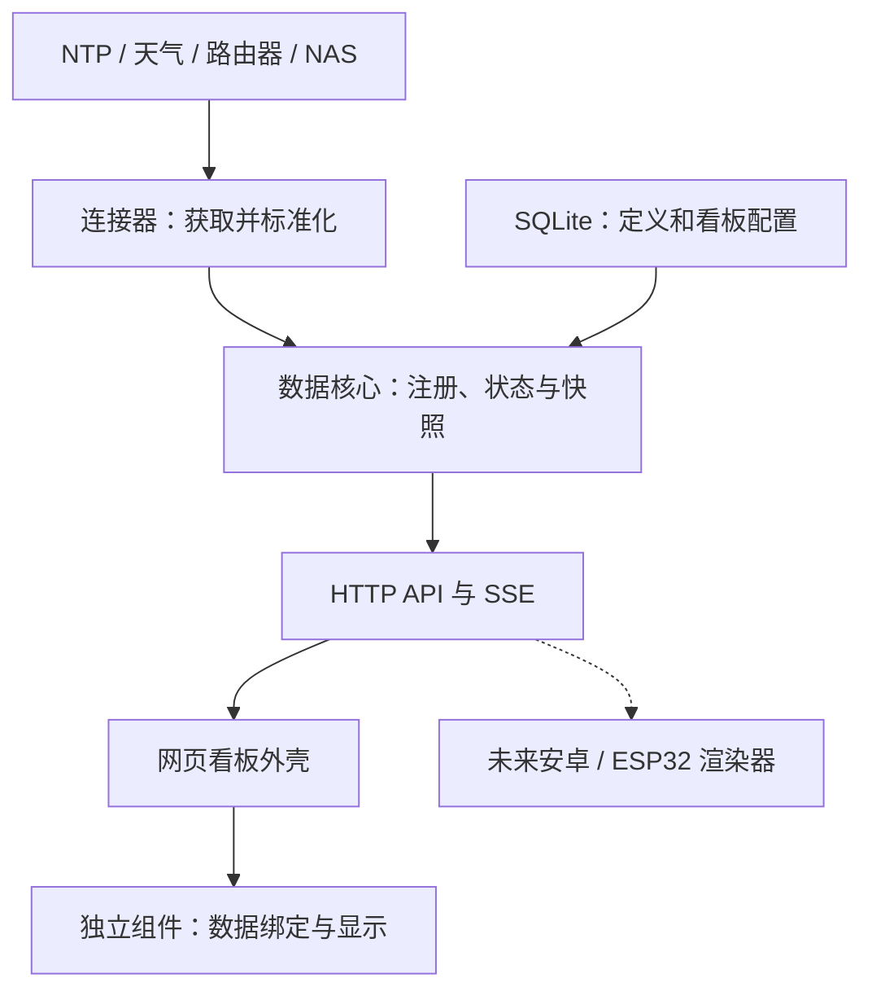

# 系统架构

## 五层及依赖方向

代码依赖：contracts 无应用依赖；connector-sdk 依赖 contracts；widget-sdk 依赖 contracts 和 React；连接器依赖 connector-sdk；网页组件依赖 widget-sdk 和 ui；server 组合连接器；web 组合组件。不得出现 connector → widget、widget → server 内部文件、widget → widget 内部实现的依赖。

## 部署模型

生产镜像包含后端 bundle 和 Vite 构建后的静态网页。Fastify 提供 `/api/v1/*`、健康检查和静态文件，只暴露 TCP 3000。开发时 Vite 独立提供热更新，代理 API 至后端。

单进程的采集调度、SQLite 写入和 SSE 管理都由后端统一拥有。模块解耦不等于进程隔离：死循环、内存泄漏仍可能影响整个应用。需要运行不受信任连接器时，必须单独设计 worker/进程隔离和资源限额。

## 数据流

1. 启动时校验环境配置，打开 SQLite 并迁移表结构。
2. 幂等注册 `dp_000001`，加载持久化的默认看板。
3. NTP 连接器进行采集，将成功结果或失败状态交给数据核心。
4. 数据核心维护本进程时间基准和新鲜度；不从旧数据库恢复“已同步”状态。
5. 客户端 GET 快照，按 bindings 将数据传给组件。
6. SSE 只传递 invalidation，客户端重新读取快照；周期性读取用于时间校准及断线补偿。
7. 组件每秒使用本地单调计时器推算当前时间，采集频率与绘制频率完全分离。

## 各模块拥有的状态

| 模块     | 拥有                             | 不拥有                     |
| -------- | -------------------------------- | -------------------------- |
| 连接器   | 请求、超时、重试轮次、资源清理   | React、主题、布局          |
| 数据核心 | 数据点、最新有效样本、新鲜度     | 卡片像素和组件动画         |
| 存储     | 看板、定义、最后同步诊断         | 可跨重启直接沿用的单调时钟 |
| API      | 版本、快照、错误格式、客户端通知 | 外部数据源请求频率         |
| 看板     | 组件注册表、实例、绑定、位置     | 每个组件专用业务           |
| 组件     | 固定视觉、格式化、内部展示状态   | 外部网络请求、其他组件状态 |

## 生命周期

- start：一次注册、一次采集启动，防止重叠启动。
- poll：任何时刻最多一轮 NTP 请求；依次尝试已配置服务器，成功即结束。
- stop：停止下一轮调度和状态计时，正在进行的请求在有界超时内完成；停止后不再发布结果。
- shutdown：关闭 SSE、HTTP、采集器和数据库。
- restart：保留配置，清空运行时信任，重新 NTP 同步。

## 扩展边界

连接器通过 TypeScript 接口注册，组件通过显式注册表安装，首版没有运行时扫描或上传代码。组件 package 中的静态 manifest 是公开的，后端凭证永远不可进入网页 bundle。

未来设备获得相同数据点 ID、组件类型标识和语义配置；设备渲染器声明支持列表。不支持的类型显示可解释占位。网页组件不会自动变成原生安卓或 ESP32 组件。

未来多实例部署需要外置采集租约、事件分发和支持并发服务的数据库。首版禁止把同一个 SQLite 文件挂载给多个写实例，也不在同步网盘或网络文件系统里运行数据库。
